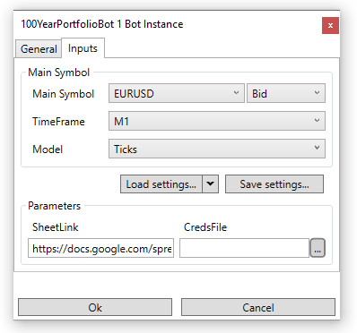
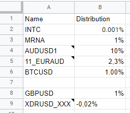

100YearPortfolioBot
===

## Idea
Based on the stock distribution in the *Portfolio* sheet, this bot open and changes positions according to desired distribution.

## Description
The bot opens/closes Limit orders so that the total amount of money invested by Symbol (orders + positions) is equal to the percentage of the account balance in *Portfolio* every N minutes.
If the equity loss is critical the bot will be stopped.

## Required Links
**To run the bot, create a Google Sheet with the bot’s configuration.**

Find the template for the Google Sheet with the bot’s configuration [here](https://docs.google.com/spreadsheets/d/1ZsGQNKJPx-6uD1zk2xgob47NaAbp7BRLplIflFuM2XU/edit?usp=sharing)

Find the Guide on how to create and set up the Google Sheet [here](https://github.com/SoftFx/AlgoBots/wiki/How-to-copy-Google-sheet-config-for-a-bot%3F)

If you want to use all features, create a test Google account. Find the Guide [here](https://github.com/SoftFx/AlgoBots/wiki/How-to-connect-with-Google-Service-credentials%3F)

## Connection to the Configuration sheet
First create the connection to Configuration before running the bot.

Setup window looks like this:

### Parameters

#### **SheetLink**
This is the link to the Configuration sheet. String parameter.

#### **CredsFile (optional)**
The path to credentials file on your computer. This parameter is necessary for updating the *Status* page in the Configuration sheet in real time mode (for more information read [here](https://github.com/SoftFx/AlgoBots/wiki/How-to-connect-with-Google-Service-credentials%3F)). String parameter.

## Settings page
The main settings responsible for the bot logic.

### Parameters

#### **Once Per N min**
A time after which a bot recalculates orders. Integer parameter. Should be greater than 0.

#### **Balance Type**
Specifies the balance for percentage calculation. Enum parameter. Possible values: Balance or Equity.

#### **Equity Min Lvl**
Protection against critical loss of money. Specifies the maximum possible change in equity as a percentage of a last starting point. Double percent parameter (must end with %).

#### **Equity Update Time (sec)**
Protection against critical loss of money. Specifies a period of time after which the starting point of equity will be updated. Integer parameter. Should be greater than 1.

#### **Status Update Timeout (sec) (optional)**
A time after which a bot refreshes *Status*. Integer parameter. Should be greater than 0. Default value is 60 sec.

## Portfolio page

The page displays stock distribution and has 2 columns: Name and Distribution. The Name column may include Notes with additional settings.

### Main settings

#### **Name**
A name of the symbol, which will be used to open orders. String value.

#### **Distribution**
A percentage of money from the account balance for opening orders. Double percent parameter (must end with %). If the value is positive, then the position side is Buy. If the value is negative, then the position side is Sell. **Total sum of the column's absolute values should be less or equal 100%.**

### Additional settings (optional, **available only with cred file**)

Additional parameters should be written as Note for the first cell.

#### **Symbol**
This is the symbol name on the server side which is used to open orders. If the symbol isn't specified, the value **Name** is used by default. String value.

#### **MaxLotSize**
Upper limit for an order volume. Positive double value. Default value is **Symbol.MaxTradeVolume**

## Filling rules
- The order of records isn't important;
- The page may include blank records;
- Property names aren't allowed to be changed.

## Algorithm

1. The bot will calculate the desired stock number for each symbol using the current **Balance Type**;
2. All previous orders (if they exist) will be canceled;
3. For each symbol **Delta money** is calculated. This is stock for desired order. Delta money = DesiredStockNumber - ActualStockNumber;
4. If **Delta money** is positive value then the desired order side is Buy else Sell;
5. The **Expected volume** is calculated using **Delta money**;
6. Ignore symbol if **Expected volume** < **Symbol.MinTradeVolume**;
7. Trying to open an order with a volume = Min(**Expected volume**, **Symbol.MinTradeVolume**, **MaxLotSize**);
8. All orders are opened with Expiration = **Once Per N min** + 1.

## Status page (available only with cred file)
The page displays current information about the account and orders.

The page consists of:
- Current time (UTC format);
- Read config;
- Current account information (Balance and Equity);
- Information about unexpected positions and orders (if they exist);
- Information about Portfolio symbols:
    - Symbol name and alias (if exists);
    - Desired symbol percentage;
    - Current delta in percentage and lots;
    - Current symbol rate.
- Current equity starting point and percentage change since last resave;
- Time until the next resave starting point of equity;
- Time until next orders recalculations.
