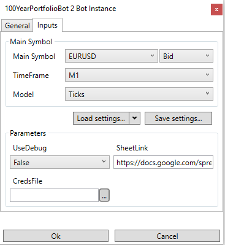
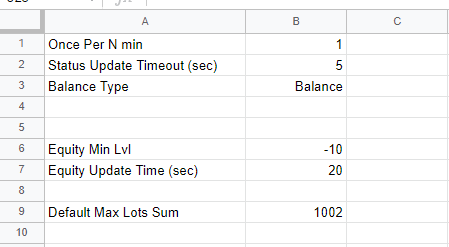
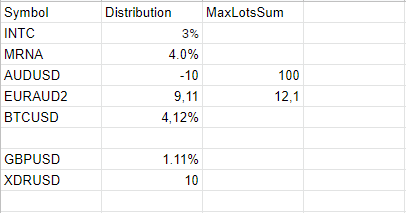
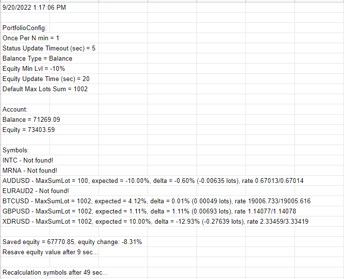

100YearPortfolioBot
===

## Idea
Based on the stock distribution in the *Portfolio* sheet, this bot tries to open and change positions according to desired distribution.

## Description
Every N minutes a bot opens/closes Limit orders so that total amount of money invested by Symbol (orders + positions) is equal to the percentage of the account balance in *Portfolio*.
Is the equity loss is critical the bot will be stopped.

## Required Links
**For bot running you have to create Google Sheet with Configuration.**

Template for Google Sheet Configuration is here (ссылка)

Guide how to create Google Sheet and setup it is here (ссылка)

## Connect to Configuration sheet
First of all you need to create a connection to Configuration before running a bot.

Setup window looks like this:

### Parameters

#### **IsDebug**
Defines whether the bot will do specific actions(for ex. additional logging) which are not required during normal usage. Bool parameter. Possible values: true or false.

#### **SheetLink**
This is link to your Configuration sheet. String parameter.

#### **CredsFile**
Path to credentials file on your computer. It is nessesary for update *Status* page on Configuration sheet in real time mode. (for more information read here (ссылка)). String parameter.

## Settings page
The main settings responsible for a bot logic.

### Parameters

#### **Once Per N min**
This is a time after whitch a bot recalculates orders. Integer parameter. Should be greater than 0.

#### **Status Update Timeout (sec)**
This is a time after whitch a bot refreshes *Status*. Integer parameter. Should be greater than 0.

#### **Balance Type**
Specifies what is the balance for percentage calculation. Enum parameter. Possible values: Balance or Equity.

#### **Equity Min Lvl**
Protection against critical loss of money. Specifies the maximum possible change in equity as a percentage of a last starting point. Double percent parameter (can be written as 10 or 10%).

#### **Equity Update Time (sec)**
Protection against critical loss of money. Specifies a period of time which the starting point of equity will be updated. Integer parameter. Should be greater than 1.

#### **Default Max Lots Sum**
Default maximum volume amount that can be opened by Symbol. Double value. Should be greater than 0.

## Portfolio page

Current page consists stock distribution and has 3 columns: Symbol, Distribution, MaxLostSum.

### Parameters

#### **Symbol**
A name of the symbol, which will be used to open orders and positions. String value.

#### **Distribution**
A percentage of money from the account balance for opening orders. Double percent parameter (can be written as 10 or 10%). If value is positive value than positions side is Buy else Sell. **Total sum absolute values of column should be less than 100%**

#### **MaxLotsSum**
A maximum volume amount that can be opened by Symbol. Double value. If value isn't specified the **Default Max Lots Sum** will be applied. Should be greater than 0.

## **Filling rules**
- The order of records isn't important
- Page might consists blank records for readable
- Property names aren't allowed to be change
- Please, check that format number is Plain Text for document. Otherwise numbers with percentages and points will be read incorrectly.

## Algorithm

1. The bot will calculate the desired stock number for each symbol using the current **Balance Type**.
2. For each symbol calculate delta = DesiredStockNumber - ActualStockNumber this is stock for desired order
3. If delta is positive value then desired order side is Buy else Sell.
4. Ignore symbol if volume of desired order will be less then **Symbol.MinTradeAmount**
5. Ignore symbol if total volumes sum by symbol greater than **MaxLotsSum** or **Symbol.MaxTradeAmount**
6. If total sum volumes by symbol greater then **MaxLotsSum** then all limits will be cancaled
7. Open orders while actual orders volume by symbol less than desired volume
8. Orders will be opened with Experation = **Once Per N min** + 1

## Status page
This page is allowed only if you connected with a credential file and consists current information about account and orders.

The page consists of:
- Current time (UTC format)
- Read config
- Current account information (Balance and Equity)
- Information about Portfolio symbols:
    - Desired symbol percentage if it is exist
    - Current delta in percentage and lots
    - Current symbol rate (available only in Debug mode))
- Current equity starting point and percentage change since last resave
- Time until next resave starting point of equity
- Time until next orders recalculations